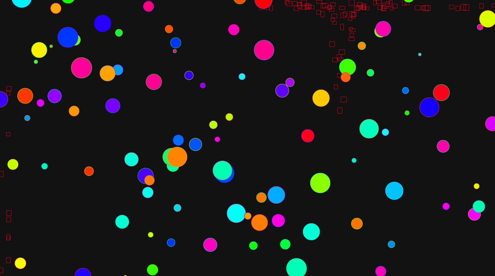

Subject : 
Canvas

My work : 
- Just some balls and squares/rectangles ! It was the first time for me with full JSOO (I think it is ?)
- Try some mousedown !

Features : 
- Infinite geration of balls with random radius, position and color
- Balls's border is an other circle under the first one
- At mousedown, we create a lot of squares, they have, again, random dimensions (color is determined)
- Squares spawn at mouse position and their future depends on the position of the mouse during the event 
- Destruction of entity when they quit the canvas's area
- Bubble sound for a best immersion 
- Little easter egg with horrible voice... I advise against trying !

Format: 

It's not necessarily very complex but I tried to do it only in object oriented and do it properly.

Thanks for testing it !